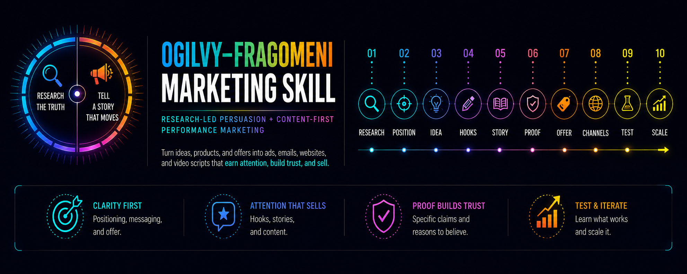

# 🎯 Ogilvy–Fragomeni Marketing Skill

Turn products, services, brands, concepts, and ideas into marketing that earns attention, builds trust, and sells.

---


## What this is

A marketing strategy and copywriting skill that combines:

- research-led persuasion
- clear positioning
- strong offers
- big campaign ideas
- storytelling
- education-led content
- creator-style hooks
- performance testing

into one practical system for producing marketing across channels.

Designed for agents that can either:

- have a short discovery conversation with the user
- or ingest a detailed product / brand / offer brief and start immediately

---

## Core Philosophy

> Earn attention like a modern creator.  
> Make the case like a great advertiser.  
> Build the brand while doing both.

---

## The System

```text
research → positioning → selling truth → audience tension → big idea
→ hooks → stories → proof → offer → channel execution → test → learn → scale
```

---

## The Two Sides

### Ogilvy side

Focuses on:

- research
- positioning
- clarity
- specificity
- proof
- brand image
- big ideas
- persuasive headlines
- selling effectiveness

### Fragomeni side

Focuses on:

- hooks
- storytelling
- education
- relevance
- repetition
- trust
- content systems
- creative volume
- performance feedback

### Combined

The skill uses both:

> **one strategic spine + many creative executions**

---

## What it can create

- paid ads
- Meta / TikTok / YouTube creative
- email campaigns
- landing pages
- homepage copy
- product pages
- short-form video scripts
- long-form video outlines
- social content
- founder-led content
- campaign concepts
- messaging frameworks
- positioning
- offers
- hooks and headlines
- creative testing plans
- marketing critiques and rewrites

---

## Who this is for

- founders
- marketers
- ecommerce brands
- SaaS teams
- creators
- agencies
- freelancers
- product marketers
- copywriters
- growth teams
- AI-assisted builders

---

## How it works

### 1. Short conversation

Give the agent a rough idea.

It will ask only the most useful questions:

- What are we selling?
- Who is it for?
- What problem or desire does it address?
- Why choose this over alternatives?
- What proof do we have?
- What action should the customer take?
- Where will the marketing appear?

Then it produces the work.

### 2. Full brief

Paste a detailed description of:

- the product
- audience
- offer
- market
- positioning
- customer research
- objections
- proof
- brand voice

The skill extracts what matters and moves directly into strategy and execution.

---

## Example prompts

```text
use ogilvy-fragomeni-marketing-skill:

help me market this product.
ask me only the minimum questions you need.
```

```text
use ogilvy-fragomeni-marketing-skill:

here is our full product brief.

create:
- positioning
- one big campaign idea
- 3 creative angles
- 3 Meta ads
- 2 email concepts
- homepage hero copy
- 2 short-form video scripts
```

```text
use ogilvy-fragomeni-marketing-skill:

critique this landing page.

tell me:
- what is weak
- what should stay
- what should change
- why
- then rewrite it
```

```text
use ogilvy-fragomeni-marketing-skill:

turn this founder story into:
- 10 hooks
- 3 short-form video scripts
- 1 email
- 1 retargeting ad
```

---

## What you should expect

The skill should identify:

- the real audience
- the customer problem
- the desired outcome
- the strongest selling truth
- the main differentiator
- the available proof
- the key objections
- the right positioning
- the campaign-level idea
- the strongest hooks
- the most useful story angles
- the right offer framing
- what to test first

Then it turns those into channel-ready outputs.

---

## Principles

### 1. Do the homework

Good marketing begins with the customer, product, category, and competition.

### 2. Find the selling truth

Do not hide a strong product behind vague language.

### 3. Position clearly

Make it obvious:

- what this is
- who it is for
- why it matters
- why it is different

### 4. Find the big idea

A strong campaign idea should generate many executions.

### 5. Hook before you explain

The first line, visual, or second must earn attention.

### 6. Use specifics

Facts beat adjectives.

### 7. Teach something useful

Education can create attention before purchase intent exists.

### 8. Use story to carry the truth

Stories create memory and connection.

### 9. Build trust before extracting value

Not every piece of content needs to sell immediately.

### 10. Keep the product connected to the creative

Attention without persuasion is entertainment.

### 11. Repeat the strategy, vary the execution

Keep the core idea stable.

Change:

- hooks
- stories
- formats
- examples
- demonstrations

### 12. Test what matters

Test different hypotheses, not cosmetic variations.

---

## Output modes

The skill includes dedicated logic for:

- paid advertisements
- email
- website / landing page
- product page
- short-form video
- long-form video
- organic social
- founder-led content
- campaigns
- creative testing
- critique / rewrite mode

---

## Guardrails

The skill should never invent:

- testimonials
- customer numbers
- performance results
- scientific evidence
- awards
- partnerships
- fake scarcity
- fake deadlines
- guarantees
- competitor claims

If proof is missing, it should say so.

If a claim needs evidence, it should use a placeholder such as:

```text
[insert verified customer result]
```

---

## The combined philosophy

> Facts create credibility.  
> Stories create connection.  
> Offers create action.  
> Systems create growth.

The goal is not to imitate either marketer.

The goal is to combine the strongest transferable principles from both approaches into one usable marketing system.

---

## Files

```text
ogilvy-fragomeni-marketing-skill/
└── SKILL.md
```

---

## License

MIT

---

## ⭐ If this helps you create better marketing, star the repo.
